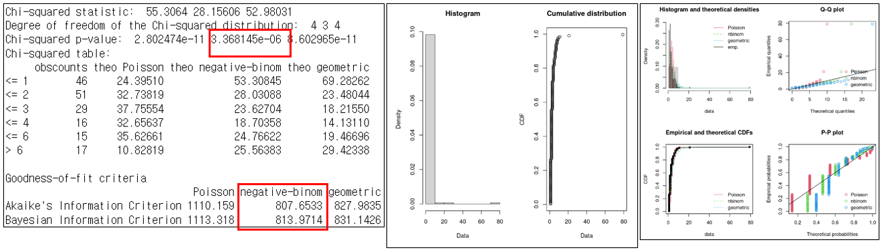
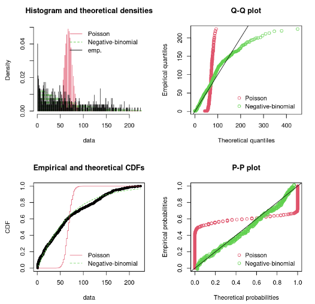

# Lab-note

## Overview

**[[02 / POSTECH] Analysis of Cyber risks related to natural disasters](#analysis-of-cyber-risks-related-to-natural-disasters)** 

- [2023.12](#2023-12-01)
- [2023.11](#2023-11-01)
- [2023.10](#2023-10-08)
- [2023.09](#2023-09-06)
- [2023.08](#2023-08-31)
- [2023.07](#2023-07-28)

**[[01 / Inha] Diffusion-C: Unveiling the Generative challenges of Diffusion models through Corrupted data](#research-on-the-robustness-of-diffusion-generative-models)** 

>  ***🔥 Accepted at <u>NeurIPS 2023, Workshop on Diffusion Models</u> 🔥*** **[[Paper]](https://arxiv.org/abs/2312.08843)**

- [2023.10](#2023-10-02)
- [2023.09](#2023-09-18-)
- [2023.04](#2023-04-01)
- [2023.03](#2023-03-27)

## Analysis of Cyber risks related to natural disasters

### 23-12-04


<hr>

### 23-12-02

**Cyber risk에서 Lasso를 이용해 변수들 select + GLM분석**

- Nat-cat에서 했던 방식대로, Cyber risk에 대해서도 변수를 select하여 GLM 회귀분석을 하였고, 다음과 같이 결과가 나왔다.

  - 

  - | 회귀분석 결과 | 변수 명                                                  | P-value |
    | :-----------: | -------------------------------------------------------- | :-----: |
    |    0.0045     | `cyber.legal.liability`                                  |   ***   |
    |    1.1016     | `sub.risk`, Improper Business or Market Practices        |   ***   |
    |     1.029     | `sub.risk`, Suitability, Disclosure & Fiduciary          |   ***   |
    |     1.218     | `sub.risk`, Systems                                      |   ***   |
    |    -1.501     | `sector`, Financial Services                             |   ***   |
    |    -0.749     | `sector`, Information                                    |   ***   |
    |     1.263     | `sub.risk`, Disasters and Other Events                   |   **    |
    |     1.478     | `sub.risk`, Product Flaws                                |   **    |
    |    -0.299     | `region`, North America                                  |   **    |
    |    -1.008     | `sector`, Utilities                                      |   **    |
    |  0.00000162   | `cyber.assets`                                           |    *    |
    |     0.289     | `sub.risk`, Systems Security                             |    *    |
    |     0.422     | `sub.risk`, Transaction Capture, Execution & Maintenance |    *    |
    |    -1.217     | `sector`, Mining                                         |    *    |
    |    -3.507     | `sector`, Other Services (except Public Administration)  |    .    |
    |    -1.589     | `sector`, Real Estate, Rental and Leasing                |    .    |


> **🚫 library(ggGam)에서 다음과 같은 에러가 발생했습니다: 'ggGam'이라고 불리는 패키지가 없습니다.** ([참고링크](https://bookdown.org/cardiomoon/gam/))
>
> - ggGam 패키지는 github를 통해 설치해야한다고 한다.
>
> - ```R
>   install.packages("devtools")
>   devtools::install_github("cardiomoon/ggGam")
>   library(ggGam)
>   ```
>
> **💬 빈도에 대한 GLM 분석을 할 때, y값은 무엇인가?**
>
> - 
>
> **💬  회귀분석에서 P-value의 의미는?** [링크](https://blog.minitab.com/ko/adventures-in-statistics-2/how-to-interpret-regression-analysis-results-p-values-and-coefficients)
>
> - 회귀분석할 때 귀무가설은 "계수가 0이다"이며, p값이 낮으면 (<0.05) 귀무가설을 기각할 수 있다.
> - p값이 낮은 예측변수는 예측변수 값의 변화가 반응변수의 변화와 연관성이 있으므로 모델에 유의미한 요소로 작용할 수 있다.
>
> **💬 R에서 회귀분석 모델의 결과값 `Pr(>|t|)`에 대한 설명** [링크](https://www.statology.org/interpret-prt-regression-output-r/)
>
> - `Pr(>|t|)` 는 t값 열의 값과 연관된 p값을 나타낸다.
>
> - `Pr(>|t|)`를 해석하는 과정을 예시를 통해 알아보도록 한다.
>
>   - | Variable    | Estimate | Standard error | t-value | Pr(>\|t\|) |
>     | ----------- | -------- | -------------- | ------- | ---------- |
>     | (Intercept) | 10.0035  | 5.9091         | 1.693   | 0.1513     |
>     | x1          | 1.4758   | 0.5029         | 2.935   | 0.0325 *   |
>     | x2          | -0.7834  | 0.8014         | -0.978  | 0.3732     |
>
>   - 예측변수 x1의 p값은 0.0325이며, 이는 유의수준 0.05보다 작은 값이다. 따라서 모형의 반응변수와 통계적으로 유의한 관계에 있음을 나타낸다.
>
>   - 예측변수 x2의 p값은 0.3732로 유의수준보다 큰 값이다. 이는 모형의 반응변수와 통계적으로 유의한 관계가 없음을 나타낸다.
>
> - `Pr(>|t|)`값 계산과정은 다음과 같다.
>
>   1. 다음 공식을 사용하여 t값을 계산한다. (t 값 = Estimate / Standard error)
>
>      - ```R
>        t.value <- 1.4758 / .5029
>        ```
>
>   2. p값을 계산한다. 이 때 <u>p값은 t-분포의 절대값이 위에서 계산한 t값보다 클 확률</u>을 나타낸다.
>
>      - ```R
>        p.value <- 2 * pt(abs(2.935), 5, lower.tail = FALSE)
>        ```


<hr>
### 23-12-01

**Nat-cat에서 Lasso를 이용해 변수들 select + GLM분석**

- 우선 Lasso 회귀분석을 통해 의미없는 변수를 골라낸다. [참고한 소스코드](https://xiaorui.site/Data-Mining-R/lecture/3.C_LASSO.html)

  - 사용한 변수는 `loss`, `assets`, `employees`, `revenue`, `legal.liability`,  `sub.risk`, `region`, `sector`으로 총 8가지의 변수를 사용하였으며, Dummy variable로 변환하여 살펴보았다.
  - 그 결과, 최적의 lambda값은 0.1116067이 나왔으며, 이를 통해 회귀분석을 돌린 결과, `sub.risk.systems`와 `sector.manufactoring` 변수가 의미가 없다고 결과가 나왔다.

- Lasso 회귀분석을 통해 selection한 변수들을 바탕으로 GLM 회귀분석을 하였다.

  - 

  - | 회귀분석 결과 | 변수 명                                              | P-value |
    | :-----------: | ---------------------------------------------------- | :-----: |
    |    -2.165     | `sector`, Agriculture, Forestry, Fishing and Hunting |    *    |
    |    0.01067    | `nat.legal.liability`                                |    .    |
    |     0.656     | `region`, North America                              |    .    |
    |    -0.989     | `sector`, Financial Services                         |    .    |
    |    -0.9245    | `sector`, Information                                |    .    |
    |    -3.109     | `sector`, Retail Trade                               |    .    |


> **💬 GLM을 할 때, 종속변수가 log-normal분포를 가진다면, log를 취한 후에 회귀 분석을 해야하는가?** ([참고링크](https://magesblog.com/post/2015-08-04-generalised-linear-models-in-r/))
>
> - $y_i$가 log-normal 분포를 띈다는 것은 $\log(y_i) \sim \mathcal{N}(\mu_i, \sigma^2)$임을 의미한다.
>
> - 즉, 로그를 취해줄 때 정규분포가 된다는 의미.
>
> - ```R
>   log.lin.mod <- glm(log(units)~temp, data = icecream, family = gaussian(link = "identity"))
>   ```
>
> **💬 R에서 `coef()`를 했을 때 나오는 값은 뭐지? 기울기 값인가?** ([참고링크](https://mn0317.tistory.com/7))
>
> - `coef()`함수에 최적의 lambda값을 넣고 계산해보면 회귀계수들의 값을 구체적으로 찾을 수 있다. 이때 값이 나타나지 않는 것들은 0에 해당이 되며, 이는 의미없는 회귀계수임을 나타낸다.
>
> **💬 Lasso 회귀분석은 무엇인가?** [참고링크 1](https://xiaorui.site/Data-Mining-R/lecture/3.C_LASSO.html)
>
> - Lasso Regression은 정규화 선형회귀의 일종으로, 선형회귀 계수에 대한 제약 조건을 추가하여 모델이 과도하게 적합되는 현상을 막는 방법임. [링크](https://blog.naver.com/pmw9440/221992720025)
>   - 라그랑지안 계수 ($\lambda$)를 이용해서 최적화 문제의 목적함수에 내장시켜서 함께 최적화시킴. [링크](https://sonsnotation.blogspot.com/2020/10/data-mining.html)
>   - $\hat{\beta} = \underset{\beta}{\textbf{argmin}} |y-\mathbf{X} \beta|^2_2$
> - 제약 조건이 추가되는 경우, 크기에 따라 주용하지 않은 예측 변수 중 일부가 0이 되어 모델에서 제외됨.
> - binary response가 있는 경우, `family = "binomial"`을 `glmnet()` 내에서 사용하면 됨.


<hr>

### 23-11-30

**선별한 요인들을 기반으로 cyber risk와 nat-cat GLM 분석**

- Nat-Cat 리스크에서 사용하게 될 GLM 식은 다음과 같음.
  - 

**다음 미팅 때까지 해야할 일 ✅**

> - 논문 Introduction과 Related work 작성하기
> - 유의미한 변수들 추출하기
>   - Cyber risk와 Nat-Cat을 동일하게 설정하지 않아도 됨.
>   - Lasso를 이용해서 변수 select
> - 빈도에 대해서 GLM 분석하기


<hr>

### 23-11-29

**리스크에 대한 요인 설정 및 근거 확립하기**

- existing literature들을 기반으로 GLM 분석에 사용할 요인을 select한다.

- [본 논문](https://www.sciencedirect.com/science/article/pii/S037722171830626X)에서 select한 변수들을 기준으로, natural catastrophe와의 qualitative한 상관관계들을 다룬 참고문헌들을 조사함.  

  - |            Variable            | Cyber risk                                                   | Natural Catastrophe                                          |
    | :----------------------------: | ------------------------------------------------------------ | ------------------------------------------------------------ |
    |            **Time**            | - 2000년 이전에는 몇 건의 사고만 발생한 후, 지속적으로 증가함.<br />- 손실 빈도에 유의미한 시간 패턴이 존재함. | - 우주에서 볼 때, 특정 지역의 재난은 전 지구적인 관점에서 보면 흔한 것처럼 보이지만 드문 사건임.<br />- 재해 위험관리는 드물게 발생하기 때문에 특정 지역의 손실에 대한 과거 데이터가 부족함. |
    |        **Company Size**        | - 규모와 손실액 사이에 양의 상관관계가 있음.<br />- 기업/회사의 규모가 클수록, 이용 가능한 데이터의 민감성이 증가하고 잠재적 노출 가능성도 높아지며, 운영이 더 복잡해지고 실수와 사고가 더 자주 발생함. | ❓ 자연재해 위험과 기업과 관련이 있나?                        |
    |   **Business Line/Industry**   | - banking 분야의 비즈니스 라인에서 사업부문과 loss severity간의 유의미한 차이를 보임.<br />- 당연히 연구에서는 은행업+모든 산업을 대상으로 진행하며, 금융/비금융 분야에 대해서도 구분. | ❓ 자연재해 위험과 산업부문이 관련이 어떻게 있을까?           |
    | **Event Type/Cyber Risk Type** | - 사람의 행동이 사이버 리스크의 주요 원인임을 보임.          | - SAS 내에서는 모든 케이스들이 Disasters and Other Events Systems.<br /> |
    |    **Geographical Region**     | - 사이버 규제/법적 책임, 보호기준, 규제가 전 세계적으로 다양함.<br />- Section 3.1에서 북미 기업이 유럽 기업보다 2배 이상 많은 사이버 위험사고를 경험함. | - 재난은 공간적, 시간적 손실이 상호 의존적임<br />- 해당 지역의 값의 군집과 재해의 패턴, 정책 변수에 딸 달라짐. [참고문헌](https://www.sciencedirect.com/science/article/pii/S1876610211013385) |

- 자연재해는 기업의 특징과 관련없이 발생하므로, 두 변수간의 관계를 집중적으로 다룬 논문은 없었음. 

- 단, 자연재해와 지역적 특성간의 관계를 다루고 있는 논문들은 있었음.

  - [Natural Catastrophe Risk, Insurance and Economic Development](https://www.sciencedirect.com/science/article/pii/S1876610211013385)
  - [Catastrophe Risk Management and Economic Growth](https://pure.iiasa.ac.at/id/eprint/6188/)
  - [How to deal properly with a natural catastrophe database - analysis of flood losses](https://nhess.copernicus.org/articles/12/535/2012/)


<hr>
### 2023-11-19

**참고로 Cyber risk와 Nat-cat의 Loss Frequency 분포결과는 다음과 같이 나왔다 (gofstat, plot)**

- Cyber risk

  - | Gofstat results | weibull   | gamma     | log-normal     |
    | --------------- | --------- | --------- | -------------- |
    | KS test         | 0.1538082 | 0.2258349 | **0.07036063** |
    | AIC             | 17549.58  | 19006.04  | **16565.41**   |
    | BIC             | 17561.49  | 19017.95  | **16577.32**   |

- Natural Catastrophes

  - | Gofstat results | weibull    | gamma     | log-normal     |
    | --------------- | ---------- | --------- | -------------- |
    | KS test         | 0.07131231 | 0.1732938 | **0.02686458** |
    | AIC             | 3933.814   | 4065.805  | **3865.712**   |
    | BIC             | 3941.726   | 4073.717  | **3873.624**   |

**사이버리스크 빈도분포 추정 (gofstat과 Plot)**

- Chi-squared p-value와 AIC/BIC 바탕으로, 음이항분포가 사이버리스크 빈도분포에 적합하다.
  - |                   |   pois   |     nbinom     |   geom    |     zip     |    zinb     |  zigeom   |
    | :---------------: | :------: | :------------: | :-------: | :---------: | :---------: | :-------: |
    | **$\chi^2$-test** | 6494.578 |  **24.05419**  | 83.97248  |  810.1257   |  756.7123   | 83.97048  |
    |    **P-value**    |    0     | **0.00421645** | 8.320e-14 | 1.4056e-168 | 4.3752e-158 | 8.328e-14 |
    |      **AIC**      | 2208.341 |  **1685.127**  | 1749.131  |  2137.739   |  2125.177   | 1749.131  |
    |      **BIC**      | 2211.886 |  **1692.217**  | 1752.676  |  2144.829   |  2135.812   | 1752.676  |

  - 

**자연재해리스크 빈도분포 추정 (gofstat과 Plot)**

- Chi-squared p-value와 AIC/BIC 바탕으로, 음이항분포가 자연재해리스크 빈도분포에 적합하다.
  - |             |    pois     |    nbinom     |    geom    |   zip    |   zinb   |   zigeom   |
    | :---------: | :---------: | :-----------: | :--------: | :------: | :------: | :--------: |
    | **P-Value** | 5.2270e-115 | **0.6678481** | 5.5536e-14 |    0     |    0     | 5.5536e-14 |
    |   **AIC**   |  1383.137   |   957.9549    |  1030.885  | 14032.11 | 154681.4 |  1030.885  |
    |   **BIC**   |  1387.015   |   965.7104    |  1034.762  | 14039.86 | 154693.0 |  1034.762  |

  - 

> 💬 P-value는 값이 클수록, 두 분포 간의 차이가 크다는 것 아닌가? 음이항분포의 P-value가 제일 크면 실증분포와 그만큼 차이가 많이 난다는 것 아닌가? ([참고링크 1](https://cran.r-project.org/web/packages/fitdistrplus/vignettes/fitdistrplus_vignette.html), [참고링크 2](http://databaser.net/moniwiki/wiki.php/%ED%99%95%EB%A5%A0%EB%B6%84%ED%8F%AC%EC%A0%81%ED%95%A9%EC%84%B1), [출처](https://m.blog.naver.com/moses3650/221217938069))
>
> - P-value는 대립가설이 1종 오류가 나타날 확률이다. 예를 들어 P-value가 0.185라고 하자. 
>   - 가설은 귀무가설과 대립가설이 있으며, 각각 다음과 같다고 하자.
>     - 귀무가설 (유의수준보다 P값이 클 때 채택하는 가설) : 차이가 없다 -> 정규분포이다. 
>     - 대립가설 (유의수준보다 P값이 작을 때 채택하는 가설) : 차이가 있다 -> 정규분포가 아니다.
>   - P값이 유의수준 0.05보다 크므로, 대립가설이 틀렸다고 할 수 있다. 그러므로 귀무가설을 채택하여 정규분포라고 본다.
> - **[결론]** Chi-squared test에서 P-값은 대립가설(이 분포를 따르지 않을 것이다)이 틀릴 확률을 나타내는 값이다. 따라서 P-값이 클 때 귀무가설을 채택한다.


<hr>

### 2023-11-14

**Starting Value Issue 해결**

- ```R
  for (i in 1:100000) {
    prob <- runif(1, min = 0, max = 0.5)
    result <- try(fitdist(cyber.freq, "zigeom", start = list(prob = prob)), silent = TRUE)
    if (!inherits(result, "try-error")) {
      cat("Iteration", i,"/ ",prob, " completed successfully.\n")
    }
  }
  ```

- 난수를 무작위 추출하고 대입하는 과정을 반복해서 값을 발견함.

### 2023-11-06

**빈도분포에 0추가해서 분포 추정하기**

- 사이버리스크 빈도추정
  - 
- 자연재해리스크 빈도추정
  - 
- 일반리스크 빈도추정
  - 

빈도분포 추정파라미터 결과는 다음과 같이 나옴.

- | 리스크 분류    | 분포       | 파라미터                              | P-value      |
  | -------------- | ---------- | ------------------------------------- | ------------ |
  | 사이버리스크   | 음이항분포 | $r = 1.964745$<br />$\mu = 3.459599$  | 3.368145e-06 |
  | 자연재해리스크 | 음이항분포 | $r = 1.023639$<br />$\mu = 71.989525$ | 0.03095136   |
  | 일반리스크     | 음이항분포 | $r = 1.914281$<br />$\mu = 3.562370$  | 0.001326198  |

**내일 할 내용**

- 분포 추정관련 논문에서는 주로 p값이 어떤지 확인해서 정리하기

### 2023-11-02

**<미팅 내용 정리>**

(1) Direct-Indirect cost 분류

- 키워드를 이용해서 분류하기로 하였음.
- 다음과 같이 Category를 분류한 다음, 
  - 

### 2023-11-01

**[분포 재추정 결과]**

- 빈도 히스토그램에서 x축은 날짜가 아닌, 각 날짜마다 발생한 횟수가 되어야 한다. 재훈이형한테 물어보고 알게 되었음.

- 빈도 히스토그램 추정결과는 다음과 같다.

  - |  Distribution  |                         Emp vs Theo                          | Chi-squared statistic | chi-squared p-value |     AIC      |     BIC      |
    | :------------: | :----------------------------------------------------------: | :-------------------: | :-----------------: | :----------: | :----------: |
    |   포아송분포   |  |          Inf          |          0          |   27722.50   |   27726.76   |
    | **음이항분포** |  |        64.019         |     2.2477e-07      | **5447.686** | **5456.205** |

  - 

  - 

- 심도 히스토그램도 위와 같은 형식으로 정리해준다.

  - | Distribution |                         Emp vs Theo                          |  K-S test   |     AIC      |     BIC      |
    | :----------: | :----------------------------------------------------------: | :---------: | :----------: | :----------: |
    |    웨이블    |  |   0.10331   |   276119.0   |   276135.9   |
    | **로그노말** |  | **0.04022** | **266499.0** | **266515.9** |
    |     감마     |  |  0.2107332  |   293512.3   |   293529.2   |

  - 

  - 

**[질문 및 논의해야하는 부분 정리]**

~~Q1. 빈도 히스토그램에 맞는 분포 피팅을 하는 과정에서 x축 값은 어떻게 설정?~~ (x축은 각 계급(날짜)마다 발생한 횟수)

- ~~예를 들어 2020년 1월 1일은 20200101로 해서 2020만 101로 설정하나? 아니면 계급을 나누어서 계급별로 인덱스를 라벨링해주어야 하나?~~

Q2. Severity는 어떻게 잘 하겠는데 Frequency 피팅 결과가 p-value 0.00000022477로 좋지 않음. 포아송 분포와 음이항 분포 어떤 것도 따른다고 하기 애매한 결과임.

Q3. 직접적 비용과 간접적 비용 분류하는 내용을 찾지 못해, 키워드를 추출하려고 함. (1) 이게 좋은 방법인가? 그리고 (2) 키워드는 어떻게 추출하면 좋을까?

### 2023-10-31

**<Indirect cost와 Direct Cost 분류와 관련된 논문/방법론 탐구 및 탐색>**

- 분류 방법은 크게 (1) 키워드를 추출해서 Description 내 포함여부로 분류하거나, (2) 포함된 Sector/Activity의 개수로 분류할 수 있을 것 같음.

  - **(1) 키워드로 분류하는 방법**

    - | Category      | Keywords                                                     | 참고 링크                                                    |
      | ------------- | ------------------------------------------------------------ | ------------------------------------------------------------ |
      | Direct Cost   | liability,                                                   |                                                              |
      | Indirect Cost | legal charges, salary, salaries insurance, rent, tax, taxes, rate, rates, accounting, financial services, | https://www.indeed.com/career-advice/career-development/indirect-expenses |

  - **(2) 포함된 Sector/Activity의 개수로 분류하는 방법**

    - 
    - https://ospi.k12.wa.us/sites/default/files/2023-08/indirect_qa.docx 
    - SAS 데이터셋 내 비슷한 특징을 갖는 칼럼은 `Sub Risk Category`, `Activity`, (`Legal Liability`) 등이 있음.

**<분포 추정 결과 - (1), (2), (3)>**

- **(1) 빈도 히스토그램과 Discrete distribution 추정 결과**

  - 빈도수 추출은 월 단위로 계산하였음. (년별로 하게 되면 데이터 수가 너무 적게 나오고, 일별은 데이터에 표시되어 있지 않아 전부 X월 1일로 통일함.)

  - | Discrete Distribution | Emp vs theo                                                  | Chi-squared statistic | Chi-squared p-value |
    | --------------------- | ------------------------------------------------------------ | --------------------- | ------------------- |
    | Poisson               |  | 32273459              | 0                   |
    | N-binom               |  | 181277                | 0                   |


- **(2) 심도 히스토그램과 Continuous Distribution 추정 결과임.**
  - 
  - ✅ 심도 히스토그램은 lognormal 분포를 따른다.
    - 
- **(3) 이렇게 구한 빈도분포와 심도 분포를 aggregation한다 (다음 [링크](https://rpubs.com/vidhya36/305854)를 참고하였음.)**
  - 각각 추정한 모수를 가지고 그래프를 그리면 다음과 같이 그릴 수 있음.
    - 
  - 

### 2023-10-30

**<해야할 내용 정리>**

- 시험공부로 인해 연구를 하지 못했다. 해야할 일들을 먼저 정리한다.
  - Direct cost와 Indirect cost를 분류한 사례 찾아보기 (다른 분야여도 괜찮음)
  - R로 SAS 데이터셋 분포 추정하기

### 2023-10-16

**<일주일 동안의 내용들 정리>**

- indirect cost와 direct cost를 분류하는 논문을 찾아볼 것.
  - 각각의 성격, 특징들을 설명하는 논문이나 링크는 많았으나, 데이터 분석을 통한 분류를 다룬 자료는 없었음.
- 프레임워크 순서도 작성하기
  - [프레임워크 pdf]()
- 실증데이터와 discrete 분포를 이용한 fitness
  - python으로 fitting을 하려고 했는데, 적합한 함수 및 라이브러리가 python에는 없었음. 
  - 이로 인해 R을 이용해서 분포 피팅을 시도

### 2023-10-10

**<미팅 내용 정리>**

- 본 연구는 자연재해로 인해 발생하는 사이버리스크를 분석하는 것이므로, **단순 화재는 자연재해로 간주하지 않음.**
- indirect cost와 direct cost를 분류하는 논문을 찾아볼 것.
- 무턱대로 하는 것이 아니라 **관련 연구들을 찾아보면서 연구할 것.**
  - [링크](https://quantatrisk.com/2016/06/05/loss-distribution-operational-risk/)를 보면서 했는데, 교수님께서 요구하신 부분과 완전히 다른 내용을 하고 있었음...
  - Frequency Distribution은 포아송 분포를 따를 수도 있으나, 대부분의 논문에서는 음이항 분포를 따른다고 함. 
  - 또한, 연도별로 보는 것이 아니라 월별로 손실을 볼 것.
- **Framework** 만들 것
  - 전반적인 그림을 그려놓고, 내가 현재 어느 위치에 있는지를 보면서 할 것.
  - Cyber risk, Nat-Cat, Operation 그리고 Cyber-Nat-Cat으로 나눌 수가 있는데, 전자는 데이터 분석으로 손실분포를 추정하고, Cyber-Nat-Cat은 데이터의 수가 적어 robust하지 않으므로 전자들의 결론들을 바탕으로 마지막에 시나리오를 작성할 것임.
  - 후자의 경우 Loss값이 크게 나오면 이상적인 결론이 될 것임.

**<내일 해야할 일>**

- 프레임워크 순서도 맞는지 확인하기
  - 특히 (1) 몬테카를로 시뮬레이션 부분 어떻게 하는건지, (2) GLM, GAM을 이용하여 요인분석하는 부분은 언제 하는건지
- 실증데이터와 음이항분포 fitting은 어떻게 하는건지 확인하기
- 본 내용과 비슷한 flow의 논문은 어떤 것이 있는지.

### 2023-10-08

**<해야할 일 순서 정리>**

- **(1) BERT로 데이터 분류하기** ✅
  - 사이버 리스크는 잘 분류가 되었다는 가정하에 BERT를 사용함.
  - `Cyber Risk == 0`인 경우는  `Natural Disaster1 == Natural Disaster2`
  - `Cyber Risk == 1`인 경우는 `Natural Disaster2`는 BERT가 분류한 대로.
    - 그 결과 `Cyber Risk == 1`인 경우 중, `Natural Disaster1 != Natural Disaster2` 인 케이스는 7개 밖에 없었음 (101, 648, 839, 1009, 1264, 1335, 1583)
- **(2) 분류된 4가지 경우에 대해서 Loss Frequency Distribution과 Loss Severity Distribution 그리기 ([링크 참고](https://quantatrisk.com/2016/06/05/loss-distribution-operational-risk/))**
- **(3) Combined된 Loss Distribution 출력하기**

### 2023-09-25

**<미팅 내용 정리>**

- 교수님과 미팅을 하였고, 아래 내용들을 다루었다.

  (1) 리스크관리 분야에서는 결과보다는 시나리오 분석 (시사점)이 매우 중요하다. numerical metrics는 support요소이고, 시나리오 분석이 메인이다.
  
  - 시나리오 분석을 잘 다룬 논문은 아래 링크를 참고한다.
  - [The Economic Impact of Extreme Cyber Risk Scenarios](https://www.tandfonline.com/doi/epdf/10.1080/10920277.2022.2034507?needAccess=true) | [Cyber Risk Management for Critical Infrastructure: A Risk Analysis Model and Three Case Studies](https://onlinelibrary.wiley.com/doi/epdf/10.1111/risa.12844)
  
  (2) 이제 데이터셋 내 케이스들이 분류가 되면 이를 이용하여 빈도 히스토그램과 심도 히스토그램을 만들어 분포를 추정한다. 분포를 추정하면 각각의 분포에서 값을 뽑아서 데이터기반으로 시뮬레이션을 돌린다.
  
  - 예를 들어 1년에 3회정도 발생한다고 추정되면, 심도 분포표에서 3번 값을 임의 추출하여 빈도와 align시킨다.
  - 빈도 히스토그램은 가장 오래된 샘플과 가장 최근 샘플을 추출하고, 이를 기준으로 구간을 설정하면 된다.
  - 빈도와 심도를 GLM/GAM 모델에 넣어 이들을 설명하는 적합한 요인을 분석할 수 있다.
  - 이 부분은 LDA (Loss Distribution Approach)를 공부를 해야 한다.
  
  (3) 심도 히스토그램에서 구간 세분화를 시켜보면 분포가 훨씬 더 smooth하게 그려질 것. 

**<다음 미팅까지 해야할 일들 정리>**

- [1] BERT로 케이스 분류할 것.
- [2] LDA 공부해올 것.
- [3] 전체 flow를 프레임워크로 정리해올 것 (그림으로 디테일하게).

### 2023-09-18

- 교수님과의 미팅을 하기 전, 어떤 부분들을 점검해야하는지 정리했다.
  - (1) 데이터셋에 해당되는 자연재해 키워드가 여러 개라고 해서 이것들을 복제하여 따로 두는 것이 맞는지에 대한 검토 필요.
  - (2)  BERT를 Pre-training시킬 때 `test.csv`를 `train.csv`처럼 "자연"재해와 관련된 것들과 아닌 것들로 구분해서 다시 학습을 시켜야 함.
  - (3) 과연 내가 학습시킨 BERT 모델이 robust한지도 검증.
- 교수님과의 미팅에서 아래의 내용들을 다루었다.
  - **우리만의 Text Mining Method**을 구축하자.
    - 교수님이 스위스 연구소에 계실 때 한 석사과정이 텍스트데이터 마이닝과 관련된 논문을 작성하였음.
    - "asset", "outcome", "actor" 이렇게 세 분야로 구분해놓고, 세 분야에 공통으로 포함되는 단어들만 추출하는 방식을 채택했다고 함.
    - BERT를 사용한 것 자체가 학술적으로 논문이 되기는 어려우나, 수리적인 모형(Pseudo Code)으로 논문에 작성하면 좋을 것 같음.
  - BERT를 사전학습을 시켜 자연재해 분류에 사용했던 것처럼 **사이버리스크에도 적용**할 수 있을까?
    - 웹상에는 사이버리스크 분류에 적합한 데이터셋이 없음.
    - 따라서 기존 사이버리스크 데이터셋 (Advisen, PIC)등을 사용하여 BERT를 학습시켜보자.
  - **Description으로부터 리스크 타입을 분류하는 과정이 중요**한 이유는?
    - 본 연구의 목적이 Cyber Risk, Natural disaster Risk, Operational Risk 사례들의 특징을 추출하는 것이므로, 처음에 분류를 잘해야 나중에 문제가 없을 것 같기 때문.
    - 이는 전에 디퓨전모델 연구하는 과정에서 초반에 대충 넘어간 것들이 막판에 수면 위로 올라와 고생하면서 얻은 교훈이 반영된 나의 결론임. 😁
- 이번 미팅을 통해 **이번주 내가 해야할 Task**는 다음과 같다.
  - **(1) 자연재해 트위터 데이터셋 `test.csv`에서  자연재해 사례들과 아닌 것들로 분류해서 BERT 학습 다시 시키기.**
    - validation을 위한 데이터셋도 준비해서 BERT의  robustness를 검증하는 것도 나쁘지 않을듯.
  - **(2) 사전학습 데이터셋은 다음과 같이 구성해서 BERT 학습시키기.**
    - Cyber Risk : 어드바이젠 데이터셋
    - Natural Risk : Tweets Natural disaster Risk 
    - Operational Risk : Tweets non-Natural disaster Risk (아니면 추가로 찾아봐도 될 듯).

### 2023-09-17

- 현재 **SAS데이터셋에서 Natural Disaster과의 relation여부를 분류**하는 작업을 하고 있다.
  - SAS 데이터셋은 총 3만개정도이므로, 데이터셋 하나하나를 읽고 분류하는 것은 불가능함.
  - 그러기에 대표적인 NLP모델인 [BERT](https://www.kaggle.com/code/yinchienpai/disaster-tweets-prediction-bert-pytorch)를 사용하여 분류를 진행하였음.
  - 
  - Natural Disaster Classification 데이터셋을 [Kaggle](https://www.kaggle.com/competitions/nlp-getting-started)에서 다운로드 한 후, 이를 BERT에 넣어 사전학습시킨 후, SAS 데이터셋에 fine-tuning 하였음.
  - 아쉽게도, Kaggle에는 Cyber Risk와 관련된 데이터셋은 없었음. (대신 Cyber Security와 관련된 데이터셋은 있었음.)
  - 이렇게 해서 기존에 분류된 것과 BERT가 분류한 것을 비교하여 그 유사도를 검증할 예정임.
  - 총 데이터셋이 38056개라서 전처리하는데 시간이 좀 많이 걸림. 전처리 돌려놓고 저녁이나 먹고 와야겠다.

### 2023-09-16

- **한 개의 사건에서 여러 개의 자연재해 키워드가 추출되는 문제가 발생**하였다.

  - | ID   | Description of Event                                         | keyword               |
    | ---- | ------------------------------------------------------------ | --------------------- |
    | 1    | There was an `earthquake` and ......<br />... also `typhoon` occured ...... | (earthquake, typhoon) |
    | 2    | The `fire` was ...                                           | fire                  |
    | 3    | This was...                                                  | None                  |

  - 위와 같이 자연재해와 관련된 키워드가 여러 개 있는 경우가 있었다. 이런 경우는 **아래와 같이 셀을 복사하여 해결**하였다. 총 데이터셋은 늘어났다. ($37648 \rightarrow 38056$)

  - | ID   | Description of Event                                         | keyword    |
    | ---- | ------------------------------------------------------------ | ---------- |
    | 1    | There was an `earthquake` and ......<br />... also `typhoon` occured ...... | earthquake |
    | 2    | There was an `earthquake` and ......<br />... also `typhoon` occured ...... | typhoon    |
    | 3    | The `fire` was ...                                           | fire       |
    | 4    | This was...                                                  | None       |

### 2023-09-11

교수님과 미팅을 하였고 다음과 같이 연구를 진행하기로 하였다.

- **[1] SAS 데이터셋을 <u>(1) cyber risk</u>, <u>(2) Nat-Cat(Natural-Catastrophe)</u>, <u>(3) Operational Risk(일반적인 리스크)</u>로 분류한다.**
  - 이때, 각 risk에 대한 분포가 어떠한 분포(포아송분포, 감마분포 등등)를 따르는지 fitting한다. 데이터 개수는 50개 이상이면 분포를 따른다고 가정한다.
  - Loss-Frequency 그래프
  - SAS는 전반적인 리스크를 다룬 데이터셋이다. Description은 주요한 몇몇 케이스는 eye2eye로 읽되, systematic한 방법을 구축한다. 
- **[2] 어떤 분포를 따르는지를 분석하였으면, 이를 이용하여 요인을 분석한다.** 
  - 이때 사용할 모델은 GLM, GAM을 사용한다.
- **[3] 추정한다.**
  - 연년별 손실을 추정한다.
- **[4] 그리고 시나리오 분석을 한다.**
  - 이를 통해 Nat-Cat을 통해 발생한 Cyber risk경우를 바탕으로 서로의 관계를 분석한다.

다음과 같이 진행하기로 하였으며, 우선은 이번 일주일은 SAS 데이터셋을 전처리한다.

### 2023-09-08

노가다 분류를 하면서 발견함 점

- 대부분의 단어가 1차원적 의미가 아니라 다른 비유적 의미로 사용됨.
- 1차원적 의미로 쓰이는 사례들도 대부분 "자연"재해는 아님.
- flood는 대부분 트래픽이 넘치다의 표현으로 쓰임. fire는 실행, 혹은 총격과 관련된 표현으로 쓰이며, 자연적으로 발생한 불이 아닌 인위적, 고의적으로 일으킨 방화가 다수임.
- `iffy`는 자연재해가 아니거나, 사건의 근본적인 원인이 아닌 경우에 라벨링하였음.
- 또 데이터셋 설명이 대부분 돌고 도는 것 같음. 비슷한 것들이 자주 보임.
- 과연 이 데이터셋이 이머징 리스크 연구에 적합할까? 이런 생각도 듦.

결과적으로 다음과 같은 의문점이 듦.

- 어드바이젠 데이터셋을 이용하여 자연재해 리스크를 연구한 전례/논문이 있는지?
  
  - 생각보다 자연재해가 직접적인 원인이 되어서 발생하는 사이버리스크가 없기 때문.
  - 접근 방향 : 주제 변경 or **데이터셋 변경** or 강행 or 예상치못한 솔루션?!
  
- 내가 정리해 본 **어드바이젠 데이터셋 관련 논문 리스트**

  - | Title                                                  | Jrnl/Cnf                             | Description                                                  |
    | ------------------------------------------------------ | ------------------------------------ | ------------------------------------------------------------ |
    | The drivers of cyber risk                              |                                      | 두터운 꼬리 분포를 띄는 사이버리스크는 회사의 크기가 클수록, 사건이 우발적일수록(극단적인 케이스 제외), 디지털 사용 점유율(클라우드 서비스)이 클수록 커지며, 피싱/스키밍 분야의 사건이 cyber cost가 높다. |
    | Time dynamics of cyber risk                            |                                      | Advisen, SAS, PRC 총 세 개의 데이터셋을 사용함.<br />사이버 위험 빈도가 더 빠르게 증가함을 보여줌.<br />사이버 위험 관리와 사이버 위험의 불안정성을 이해하는데 중요하다. |
    | Cyber Risk Frequency, Severity and Insurance Viability | Insurance: Mathematics and Economics | Advisen을 통해 미국의 사이버 보험산업에 대한 보험 위험 이전에 대한 탐구를 수행.<br />1) 사이버 손실 이벤트의 빈도와 심각도를 설명할 수 있는 가장 중요한 공변량<br />2) 필요한 보험료, 위험 풀 크기에 관련하여 사이버 위험의 보험 가입 여부<br />사이버 위험의 불안정성과 본질에 대한 몇 가지 새로운 핵심 통찰력을 제공하고 위의 질문을 해결. |
    
    

### 2023-09-07

키워드 분류 문제는 다음과 같이 해결한다.

- 독일 친구가 한 내용을 보니, 키워드 당 해당되는 데이터가 최대 197개, 200개 정도였으므로 **<u>하나하나 읽어보면서 분류를 했을 가능성이 커보임.</u>** 
- 따라서 **<u>deepl을 적극 활용하여 일일이 분류를 해야 할 것 같음</u>**. 총 504개의 데이터이며, 중복되는 것도 꽤 있음. 하루~이틀 정도 날 잡고 빡세게 분류를 한다. 도저히 생각해봐도 다른 방법이 떠오르지를 않는다.
- 데이터 전처리 방식은 **다음 4가지 조건**을 가지고 있어야 함.
  - price가 ice로 분류되는 경우를 방지하기 위해 순수하게 단어만 포함되도록 설정 (확인 ✅)
  - 특수 부호(,.!)를 제외하고 단어만 취급 (확인 ✅)
  - 데이터셋을 전부 소문자로 변환하여 탐색
  - 병합된 데이터셋에 셀을 직접 추가하여 Yes / No로 채워넣은 후, 완성되면 import하여 다시 전처리를 시작함

### 2023-09-06

오늘은 데이터 merge후, 자연재해와 관련된 키워드를 이용해서 `result["CASE_DESCRIPTION"]`에서 키워드가 포함이 되는지를 판단 후, <u>자연재해와의 관련여부</u>와 <u>어떤 자연재해와 관련있는지</u>를 데이터프레임에 추가하는 작업을 하였다. 하는 과정에서 다음과 같은 문제가 발생하였다.

- 키워드가 중복이 되는 경우는 어떻게 할 것인가?
  - case description에서 `Fire`과 `Earthquake` 두 개의 키워드가 포함되어 있으면 어떻게 구별해야 할까?
  - 사실 이 문제는 나중에 해결해도 됨. 그리고 심할 경우, 셀을 복붙해서 자연재해 키워드만 다르게 해도 될듯.
- 키워드가 있다고 과연 그 데이터셋이 진짜 자연재해와 관련된 데이터셋일까?
  - 이게 제일 큰 문제. 예를 들면, ice cream. ice makers. 이런 경우도 `ice`에 분류가 된다.
  - "Further, Plaintiff also began receiving a flood of calls and text messages from Defendants offering mortgage refinancing." 이 경우는 "전화가 쏟아진다"는 비유적 표현인데도 `flood`로 포함이 되어 자연재해 데이터셋으로 분류가 됨.
  - 이런 경우에는 어떻게 해결하지...?
    - 일일히 읽어서 분류한다..? -> 너무 시간낭비
    - 딥러닝을 이용해서 파인튜닝...? -> 과연 할 수 있을까?
    - 독일친구는 어떻게 분류를 했지?

내일 혼자 좀 더 고민해본 후 교수님께 말씀드려보아야 할 것 같다.

### 2023-08-31

오늘 오후 3시에 교수님과 줌미팅을 하였다. 줌미팅 내용은 지난 한 달동안 어떤 것들을 하였는지를 말씀드리는 것이었다. 

크게 (1) 논문을 읽고 들었던 생각과 (2) 어드바이젠 데이터셋을 이용하여 논문의 내용들을 어떻게 구현하였는지를 말씀드렸다. 

교수님께서는 줌미팅 이후, 크게 세 가지를 말씀해주셨다.

- 자연재해와 cyber cost를 연결지을 것.
  - 나 이전의 독일 출신이셨던 석사생께서 하시던 분야이다. 자연재해와 cyber cost를 연결 짓기. 그러기 위해선 우선 데이터셋 내 자연재해에 대한 정보를 긁어와야 할 것 같다. 음 그런데 자연재해와 관련된 칼럼이 없는 것 같은데.... 이 부분은 내일 따로 말씀드려봐야 할 것 같다. 그러고 난 후, 키워드로 조합하기.
- 테이블 join해서 하나의 데이터 프레임으로 구축하기.
  - 어드바이젠 데이터셋은 총 4개의 테이블이 있다. 이 테이블들을 공통된 칼럼을 기준으로 join을 해보라고 하셨다. 그렇게 하면 새로운 안목이 생길 수 있기 때문.
- 딥러닝 시계열 모델을 이용한 연구도 괜찮은 contribution
  - 논문을 읽으면서 딥러닝과의 접목 가능성에 대해서도 생각해보았고, 교수님께서도 괜찮다고 하셨다. 이 부분은 나중에 더 발전시켜봐야지.

### 2023-07-30

현재 "The drivers of cyber risk"논문을 읽으면서 정리하고 있다. 이 논문을 간단하게 읽으면서 (1) cyber risk란 무엇인지, (2) advisen dataset을 어떻게 다루는지 두 가지를 알아보려고 한다. 정리한 내용은 markdown으로 정리하면서 깃허브에 commit한다. 

그리고 advisen 데이터셋 구성을 잠깐 보았는데, 어떻게 전처리를 해야하는지 감이 안잡힌다. 내일 일어나서 폴더 안에 전처리 가이드가 있는지 확인한 후에 교수님께 방향성에 대해 질문을 드리고자 한다.

### 2023-07-28

대학원 입학 전, 교수님과 연구 주제에 대해서 사전 미팅을 하였다. 내가 맡게 될 연구 주제는 **기후 변화로 인해 발생하는 사이버 리스크의 관리**이다. 교수님께서 원하는 연구주제가 있다면 편하게 말하라고 하셨으나, 아직 이 분야에 대해 모르는 부분들이 많기 때문에 일단 해본 후에 판단을 해보고 싶다고 말씀드렸다.

연구를 하면서 내가 다루게 될 데이터셋은 미국 Advisen에서 만든 데이터셋 (https://www.advisenltd.com/data/) 이며, 교수님께서 말씀하신 나의 task는 아래 2가지 이다.

- Advisen 기반의 사이버리스크 관련 논문들 읽고 흐름 잡기
- Advisen 데이터셋 전처리하기

사실 메인은 2번 째 전처리 하기이며, 현 날짜로부터 3주 뒤인 8월 21-22일 사이에 연구 진행과정을 review하기로 하였다.

<hr>

## Research on the robustness of Diffusion Generative models

### 2023-10-03

<DDIM 학습시키기>

- 최대한 할 수 있을 때까지 하기 위해, DDIM 학습 결과를 넣으려고 한다. 

- 최종적으로 논문에 들어가게 될 데이터셋 실험은 CIFAR-100, Tiny-ImageNet-C, Greed Fractal, Red Fractal이다. 

  - Green Fractal

    - | Corruption name | 학습 완료 여부 | 생성 완료 여부 | FID  |
      | :-------------: | :------------: | :------------: | :--: |
      |    Identity     |       ✅        |       ✅        |      |
      |   Shot noise    |       ✅        |       ✅        |      |
      |  Impulse noise  |       ✅        |       ✅        |      |
      |   Glass blur    |       ✅        |       ✅        |      |
      |   Motion blur   |       ✅        |       ✅        |      |
      |       Fog       |       ✅        |       ✅        |      |
      |   Brightness    |       ✅        |       ✅        |      |
      |     Spatter     |       ✅        |       ✅        |      |

  - Red Fractal

    - | Corruption name | 학습 완료 여부 | 생성 완료 여부 | FID  |
      | :-------------: | :------------: | :------------: | :--: |
      |    Identity     |       ✅        |       ✅        |      |
      |   Shot noise    |       ✅        |       ✅        |      |
      |  Impulse noise  |       ✅        |       ✅        |      |
      |   Glass Blur    |       ✅        |       ✅        |      |
      |   Motion blur   |       ✅        |       ✅        |      |
      |       Fog       |       ✅        |       ✅        |      |
      |   Brightness    |       ✅        |       ✅        |      |
      |     Spatter     |       ✅        |       ✅        |      |

  - Tiny-ImageNet-C

    - | Corruption name | 학습 완료 여부 | 생성 완료 여부 | FID  |
      | :-------------: | :------------: | :------------: | :--: |
      |  $\lambda = 1$  |       ✅        |       ✅        |      |
      |  $\lambda = 2$  |       ✅        |       ✅        |      |
      |  $\lambda = 3$  |       ✅        |       ✅        |      |
      |  $\lambda = 4$  |       ✅        |       ✅        |      |
      |  $\lambda = 5$  |       ✅        |       ✅        |      |

      

### 2023-10-02

**<DDIM 실험환경 변경>**

- GPU 서버 환경에서 실험을 돌리면 계속 끝까지 학습을 못하고 중간에서 멈추는 오류가 발생하였다.
- 처음에는 할머니댁 와이파이 환경이 취약해서 발생하는 것을 추측하였지만, 이와는 관련이 없었고 GPU 서버 자체의 문제인 것을 판단되었다.
- 따라서 실험환경을 Colab으로 변경하여 학습을 진행하였다.
  - 

**<DDIM 실험 결과 정리>**

- 코랩에서 DDIM 학습시키기 ⏩ `.npy` 파일을 다운로드해서 Filezilla로 서버에 업로드 ⏩ png변환 후에 FID 스코어 계산하기

- 우선 **CIFAR-100 데이터셋**으로만 실험을 해서 DDPM과의 성능 차이를 비교하려고 한다.

  - | CIFAR-100 : Corruption | 학습완료 여부 | DDIM's FID Score | DDPM's FID Score |
    | :--------------------: | :-----------: | :--------------: | :--------------: |
    |        Identity        |       ✅       |      70.16       |      44.31       |
    |       Shot noise       |       ✅       |      52.33       |      28.76       |
    |     Impulse noise      |       ✅       |      67.35       |      28.23       |
    |       Glass blur       |       ✅       |      61.23       |      25.62       |
    |      Motion blur       |       ✅       |      56.88       |      29.82       |
    |       Brightness       |       ✅       |      68.55       |      44.10       |
    |          Fog           |       ✅       |      71.63       |      41.26       |
    |        Spatter         |       ✅       |      65.60       |      34.60       |
  
- 실험을 하는 도중, 데이터 전처리 하는 부분에서 -1과 1사이로 정규화를 시켜야 하는데 0과 1로 정규화를 시킨 부분이 있는 것을 발견하였다. Fog 학습이 끝나고, 이 부분을 수정한 뒤 학습을 시켰다.

### 2023-09-30

**<오류해결 과정>**

- DDIM 학습까지는 다 완료했다. 그런데 저장한 모델을 불러오는 과정 OOM 오류가 발생하였다.
  - 
  - 
- 해결했다 ✅. 배치사이즈를 5000으로 하여 생성을 하려고 했기 때문에 OOM (Out of Memory) 문제가 발생하였다. 
- ***💡💡 ChatGPT를 이용해서 오류를 해결할 때는 가끔 Log전체를 복붙해서 입력하는 것도 나쁘지 않다. 💡💡***

### 2023-09-29

현재 DDPM을 대상으로 한 결과는 마무리하였고, DDIM을 이용하여 DDIM-C를 진행하기 위해 모델을 수정하고 있다.  그 과정에서 여러 가지 시행착오를 겪었다.

- **(1) 첫 번째 오류** - `TypeError: generator yielded an element of shape (28, 28, 3) where an element of shape (64, 64, 64, 3) was expected.`

  - 해결했다 ✅. 기존 코드에서 데이터 전처리하는 부분에서 학습과정에 넣는 부분은 최대한 살리고, 나는 기존 데이터셋과 나의 데이터셋만 자연스럽게 교환하였음.

- **(2) 두 번째 오류** - 전체 데이터셋 / 배치사이즈의 값이 4687이다.

  - ```python
    def prepare_dataset(dataset):
        # the validation dataset is shuffled as well, because data order matters
        # for the KID estimation
        return (
            dataset
            .map(preprocess_image, num_parallel_calls=tf.data.AUTOTUNE)
            .cache()
    #         .repeat(dataset_repetitions)
            .shuffle(10 * batch_size)
            .batch(batch_size, drop_remainder=True)
            .prefetch(buffer_size=tf.data.AUTOTUNE)
        )
    ```

  - 위 데이터전처리 함수 내 `dataset_repetitions`때문이었음.

  - 그런데 1로 설정해서 하게 되면 학습이 잘 안되는 것 같아서 그냥 5로 설정하고 학습하였음.

  - 이게 맞는지는 차차 확인해야 할듯.

- **(3) 세 번째 오류** - 왜 `checkpoints/` 폴더를 만들면 접속이 안되지?

  - 사실 그렇게 큰 이슈는 아니라서 일단은 보류함.

### 2023-09-22

실험을 하고 있는 동안, 논문을 수정하는 중이다. 수정은 Open Review 평가를 최대한 반영해서 하고자 한다.

- | Review                                                       | My Feedback                                                  |
  | ------------------------------------------------------------ | ------------------------------------------------------------ |
  | 분석을 통해 향후  DDPM 관련 연구에 어떤 영감을 줄 수 있나?   |                                                              |
  | DDPM의 본질과 연결지을 수 있나?                              |                                                              |
  | 본 논문은 설명할 수 없는 분석을 수행하며 손상된 데이터에서 DDPM 생성 또는 성능을 개선할 수 있는 방법을 제시하지 않음. | (1) 설명이 불가능하다.<br />-> 어느정도는 인정. 딥러닝이 블랙박스이기 때문에 최대한 다양한 환경에서 실험을 하였음. 그리고 귀납적으로 성능을 평가하고자 함.<br />(2) DDPM의 성능 개선<br />본 논문에서는 DDPM의 성능 개선하는 것이 목적이 아니라, DDPM의 성능저하 시점을 알고자 하는 것. |
  | 동기가 불분명하다.                                           | ????????????????????<br />왜 동기가 부족하지?<br />아니 이사람들이... 논문 제대로 읽어보지도 않았으면서!!!!! |
  | 대규모 고해상도 데이터셋으로 실험을 진행할 것.               | 시간이 남으면 corrupted imagenet으로 학습시킬 것.            |
  | Preliminary에 관련없는 내용들이 많음. 더 간결하게 만들 수 있음. 견고성에 대한 연구와 같은 유용한 정보가 부족함. | B.1.을 더 줄이고, B.2.를 좀더 강조해서 쓸 것.                |
  | 기술적 기여가 부족하고, 손상프로세스만 추가하고 그 방법이 매우 간단하다. | 이건 뭐 어떻게 해야하지...?                                  |
  | 부패의 강도가 DDPM의 성능에 어떤 영향을 미치는지에 대해 더 자세히 설명해야 함. | DDPM모델에 가장 치명적이었던 fog corruption을 강도에 따라 FID 스코어를 측정하는 실험을 부록에 추가할 것. |
  | 그림4를 더 고해상도의 그림으로 대체할 것.                    | 이건 뭐 하면 되고... 정 안되겠으면 직접 그리자.              |
  | Introduction에서 견고성을 이야기하다가 갑자기 DDPM에 대한 설명으로 넘어가서 혼란스러움. | 중간에 추가하기.                                             |

그리고 아래는 논문을 퇴고하면서 수정할 사항과 수정완료 여부를 정리해놓은 표이다.

- | 수정사항 요약                                                | 이유 / Details                                               | ✅    |
  | ------------------------------------------------------------ | ------------------------------------------------------------ | ---- |
  | Return point -> Return state로 수정하기                      | figure 3을 수정하려고 하는데, 이때 수직선을 사용해서 DDPM-C의 메커니즘을 설명하려고 한다. <br />DP수업 때 주로 state라는 용어를 많이 사용하는데, 이를 적용해보면 어떨까 한다. 수정하면서 더 좋은 아이디어 있으면 오케이. | ✅    |
  | Introduction에서 Robustness▶DDPM부분 연결 매끄럽게 하기      | Review 반영사항.                                             |      |
  | Introduction에서 굳이 DDPM에 대한 설명을 해야하나? DDPM-C를 설명하면 안되나? | 뒤에서 계속 반복해서 나와 좀 지루하기도 하고, 중요하지 않아 보임.<br />(notation에는 딱히 안해도 될 거 같음.)<br />Methodology에서 설명해도 될 것 같음. |      |
  | Introduction에서 DDPM-C의 contribution을 설명할 때, 96개의 실험 환경 세팅했다, | + severity에 따른 DDPM 성능 저하 정도 실험도 추가<br />어필할 건 적극적으로 논문 내에서 어필하자. | ✅    |
  | Introduction에서 DDPM-C 동기 설명할 때 "순수한 접근(naive approach)"라는 내용 적으면 좋을 듯. | 노이즈가 DDPM Return ability에 끼치는 영향력 + severity에 따라 그 변화의 정도를 알고자 하는 순수한 접근. |      |
  | 용어 설명                                                    | Original state, original image, return state, return image, return ability, <br />2.1장에서 Return state뭐 이런것들 설명하기.<br /> | ✅    |
  | 3장에서 Figure2 해상도 높이기                                | Review 반영사항.                                             |      |
  | 3장에서 왜 FID를 사용하는지 작성하기                         | Review 반영사항.                                             |      |
  | B장에서 adversarial examples에 대한 related work 조사해서 넣기. | Review 반영사항.                                             |      |
  | C장 Extra experiments 넣기.                                  | Review 반영사항 (부패의 강도에 따른 DDPM의 성능변화).        | ✅    |
  | Introduction과 Abstract에 실험 더 추가한거랑 contribution 등등 추가해서 넣기 | 어필할 건 적극적으로 어필하자.                               |      |
  | D장 그림 다시 수정하기                                       | 엉터리였다. 수정 필요. (근데 왜 언급이 없지..?)              |      |
  | A장에서 mechanism 수직선으로 표현하기.                       | 보다 더 나은 이해를 위해...<br />단순히 왔다 갔다 한다기 보단, 노이즈의 시점으로 이 메커니즘을 이해하면 좋을 것 같기 때문에.. | ✅    |


실험을 돌리는 과정에서 아무런 오류 코드도 없이 갑자기 학습이 멈추는 이슈가 발생하였다. 

- 

- 해결 : 그냥 냅뒀더니 다음과 같은 메시지를 출력하면서 학습이 재개되었음. 

  - > IOPub message rate exceeded.
    > The notebook server will temporarily stop sending output
    > to the client in order to avoid crashing it.
    > To change this limit, set the config variable
    > `--NotebookApp.iopub_msg_rate_limit`.
    >
    > Current values:
    > NotebookApp.iopub_msg_rate_limit=1000.0 (msgs/sec)
    > NotebookApp.rate_limit_window=3.0 (secs)

- 괜히 쫄았구먼.. 아마 내일이면 모든 실험들이 다 완료되어 있겠지??

### 2023-09-21

Fog-severity 실험을 진행하고 있다. 실험 진행상황은 다음과 같다.

- 실시간으로 수정할 예정.

- | 데이터셋 ($\lambda$)  | 실험 완료 | 생성 완료 | PNG 변환($x_g$) | PNG 변환($x_0$) |    FID    |
  | :-------------------: | :-------: | :-------: | :-------------: | :-------------: | :-------: |
  |     **MNIST (1️⃣)**     |     ✅     |     ✅     |        ✅        |        ✅        | **33.7**  |
  |     **MNIST (2️⃣)**     |     ✅     |     ✅     |        ✅        |        ✅        |   16.39   |
  |     **MNIST (3️⃣)**     |     ✅     |     ✅     |        ✅        |        ✅        |   16.30   |
  |     **MNIST (4️⃣)**     |     ✅     |     ✅     |        ✅        |        ✅        |   17.77   |
  |     **MNIST (5️⃣)**     |     ✅     |     ✅     |        ✅        |        ✅        |   24.15   |
  |                       |           |           |                 |                 |           |
  | **Fashion MNIST (1️⃣)** |     ✅     |     ✅     |        ✅        |        ✅        |   42.8    |
  | **Fashion MNIST (2️⃣)** |     ✅     |     ✅     |        ✅        |        ✅        |   22.02   |
  | **Fashion MNIST (3️⃣)** |     ✅     |     ✅     |        ✅        |        ✅        |   24.24   |
  | **Fashion MNIST (4️⃣)** |     ✅     |     ✅     |        ✅        |        ✅        |   26.82   |
  | **Fashion MNIST (5️⃣)** |     ✅     |     ✅     |        ✅        |        ✅        | **31.61** |
  |                       |           |           |                 |                 |           |
  |   **CIFAR-10 (1️⃣)**    |     ✅     |     ✅     |        ✅        |        ✅        |   39.23   |
  |   **CIFAR-10 (2️⃣)**    |     ✅     |     ✅     |        ✅        |        ✅        |   37.60   |
  |   **CIFAR-10 (3️⃣)**    |     ✅     |     ✅     |        ✅        |        ✅        |   39.07   |
  |   **CIFAR-10 (4️⃣)**    |     ✅     |     ✅     |        ✅        |        ✅        | **40.12** |
  |   **CIFAR-10 (5️⃣)**    |     ✅     |     ✅     |        ✅        |        ✅        |   38.66   |
  |                       |           |           |                 |                 |           |
  |   **CIFAR-100 (1️⃣)**   |     ✅     |     ✅     |        ✅        |        ✅        |   44.11   |
  |   **CIFAR-100 (2️⃣)**   |     ✅     |     ✅     |        ✅        |        ✅        | **48.41** |
  |   **CIFAR-100 (3️⃣)**   |     ✅     |     ✅     |        ✅        |        ✅        |   47.98   |
  |   **CIFAR-100 (4️⃣)**   |     ✅     |     ✅     |        ✅        |        ✅        | **48.21** |
  |   **CIFAR-100 (5️⃣)**   |     ✅     |     ✅     |        ✅        |        ✅        |   45.15   |
  |                       |           |           |                 |                 |           |
  | **Tiny-ImageNet (1️⃣)** |     ✅     |     ✅     |        ✅        |        ✅        | **92.88** |
  | **Tiny-ImageNet (2️⃣)** |     ✅     |     ✅     |        ✅        |        ✅        |   89.34   |
  | **Tiny-ImageNet (3️⃣)** |     ✅     |     ✅     |        ✅        |        ✅        |   85.52   |
  | **Tiny-ImageNet (4️⃣)** |     ✅     |     ✅     |        ✅        |        ✅        |   83.15   |
  | **Tiny-ImageNet (5️⃣)** |     ✅     |     ✅     |        ✅        |        ✅        |   79.75   |
  
- 학습하는데 한 에폭당 6분, 총 50에폭이므로 300분 = 5시간 정도가 걸린다. 

### 2023-09-18

- 현재 severity에 따른 FID score변화 정도를 확인하기 위해 실험을 진행하고 있다. 그 과정에서 아래 오류들이 발생하였다.

  - ```
    DNN library is not found.
    ```

  - ```
    ERROR: pip's dependency resolver does not currently take into account all the packages that are installed. This behaviour is the source of the following dependency conflicts.
    tensorflow-datasets 4.9.2 requires tensorflow-metadata, which is not installed.
    tensorflow-text 2.13.0 requires tensorflow-hub>=0.8.0, which is not installed.
    tf-models-official 2.13.2 requires tensorflow-hub>=0.6.0, which is not installed.
    tensorflow-datasets 4.9.2 requires protobuf>=3.20, but you have protobuf 3.19.6 which is incompatible.
    tensorflow-text 2.13.0 requires tensorflow<2.14,>=2.13.0; platform_machine != "arm64" or platform_system != "Darwin", but you have tensorflow 2.11.0 which is incompatible.
    tf-models-official 2.13.2 requires tensorflow~=2.13.0, but you have tensorflow 2.11.0 which is incompatible.
    ```

  - ```
    ImportError: cannot import name 'convert_to_tensor_v2_with_dispatch' from 'tensorflow.python.framework.ops' (/home/osanie/.local/lib/python3.8/site-packages/tensorflow/python/framework/ops.py)
    ```

- 100% 버전 문제라 확신하고 아래의 조치들을 취하여 해결하였다.

  - (1) `! pip uninstall tensorflow tensorflow-estimator tensorflow-gpu tensorflow-hub tensorflow-metadata tensorflow-probability`
  - (2) `! pip install tensorflow==2.11.0`
  - (3) `! pip uninstall tensorflow-datasets`
  - (4) `! pip uninstall tensorflow-text -y`
  - (5) `! pip uninstall tensorlfow-datasets -y`

- Log들을 차분하게 잘 살펴보자라는 나의 교훈이 실현된 하루였다 😁

### 2023-04-06

| Title                           | Success/Fail | Detail&Feedback |
| ------------------------------- | :----------: | --------------- |
| Re-train DCGAN and WGAN         |      🔄       |                 |
| Translate and make up for paper |      🔄       |                 |

### 2023-04-05

| Title                           | Success/Fail | Detail&Feedback                                              |
| ------------------------------- | :----------: | ------------------------------------------------------------ |
| Re-train DCGAN and WGAN         |      🔄       | - DCGAN의 generator 마지막 layer의 활성화 함수가 `sigmoid`로 되어있었음<br />- Input image는 -1과 1 사이로 정규화하였기 때문에 `tanh`로 설정해주어야 함.<br />- 변경 후, 재학습 진행 중임. WGAN도 여러 부분에서 애매하다는 느낌이 들어 재학습을 진행하였음. |
| Translate and make up for paper |      🔄       |                                                              |

### 2023-04-04

| Title                               | Success/Fail | Detail&Feedback                                              |
| ----------------------------------- | :----------: | ------------------------------------------------------------ |
| Calculating FId score again.        |      ✅       | - fashionM에서 예상치 못한 결과가 발생함. $^{1}$             |
| 데이터셋 확인 및 정리하기           |      ✅       | 1. np.uint8로 변환<br />2. 크기 (5000,64,64,3)으로 통일      |
| fashionM identity 학습 및 생성 진행 |      🔄       | - fashionM identity 생성 이미지가 잘못 생성되었음. 학습부터 생성까지 다시 진행하고 있다. |

**$^{1}$ 결과 원인** 

1) 데이터 타입이 다른 데이터셋은 np.uint8인 반면, fashionM은 np.float32였음.  $\rightarrow$ <u>np.uint8로 예쁘게 만들어준다.</u>


2) 한 데이터셋은 (5000,28,28,3)이었고, 다른 한 데이터셋은 (5000,64,64,3)이었다. $\rightarrow$ <u>모든 데이터셋 (5000,64,64,3)으로 통일시켰음.</u>
3) 생성된 이미지 중 하나를 출력했는데 아래와 같이 순수 노이즈 이미지가 나왔다. $\rightarrow$ <u>다시 학습시켜 생성 중.</u>


**<u>오늘의 교훈 : 데이터 전처리는 통일된 형태, 규칙적인 형태로 진행하는 것이 좋다. 아니면 오늘과 같은 현상 반복될 듯.</u>** 

### 2023-04-03

| Title            | Success | Detail&Feedback                                              |
| ---------------- | :-----: | ------------------------------------------------------------ |
| GPU Set_Up Again |    ✅    | - 현재 사용하고 있는 버전은 nvidia-smi 510.85.02 / cuda 11.6 / cudnn 8.8.0 /  tensorflow-gpu 2.11.0. 이렇게 하면 호환이 되지 않으며, cudnn버전을 8.2.0으로 변경하여 재설치하였음. |

**오류 원인**

- nvidia driver version, cuda version, cudnn version, tensorflow-gpu version 등 버전을 맞추기 위해서 계속 설치하고 했는데도 잘 안됨.
- `import tensorflow as tf` 를 입력하고 나오는 에러를 자세히 읽어보니 `from tensorflow.keras.scipy` (자세히 기억 안남)에서 오류가 잡힌 것을 발견.
- `pip install scipy`해서 최신 버전으로 재설치 하니 돌아갔다.
- 오류 원인은 아마도 `pip install fid-score`를 할 때 requirement내 scipy버전이 최신버전이 아니여서 발생한 것 같다. 
- **<u>오늘의 교훈 : 오류가 발생했을 때는 컴퓨터가 나에게 하는 말을 찬찬히 자세히 읽어보자!</u>**

### 2023-04-02

| Title                | Success/Fail | Detail&Feedback                                              |
| -------------------- | :----------: | ------------------------------------------------------------ |
| Calculate FID scores |      ✅       | - 원하는 결과가 안나왔음. <br />- 연구주제 변경 및 보완 필요함. |

### 2023-04-01

| Title                | Success/Fail | Detail&Feedback |
| -------------------- | :----------: | --------------- |
| Calculate FID scores |      🔄       |                 |

### 2023-03-31

| Title                                                | Success/Fail | Detail&Feedback                                              |
| ---------------------------------------------------- | :----------: | ------------------------------------------------------------ |
| Generating images of FashionM motion blur from dcgan |      ✅       |                                                              |
| Generating images of FashionM motion blur from wgan  |      ✅       |                                                              |
| Generating images of mnist identity from ddpm        |      ✅       | - 검토를 해보니 images of mnist identity from ddpm의 shape이 (3000,64,64,3)로 찍혔음. 다시 생성하였음. |
| Generating images of cifar100 motion blur from ddpm  |      ✅       |                                                              |
| Calculate FID scores                                 |      ❌       | - Kernel Dead 현상을 방지하기 위해 batch size를 적절하게 줄인다. |

### 2023-03-30

| Title                             | Success/Fail | Detail&Feedback                                              |
| --------------------------------- | :----------: | ------------------------------------------------------------ |
| Generating images from ddpm       |      🔄       | - 내일 오후정도면 이미지 추출 완료예정.<br />- 현재 4개 중 2개의 데이터셋 추출 완료. |
| Translating papers (part 1,2,3)   |      🔄       |                                                              |
| Illustrating figures with draw.io |      🔄       |                                                              |

### 2023-03-29

| Title                                                        | Success/Fail | Detail&Feedback                                              |
| ------------------------------------------------------------ | :----------: | ------------------------------------------------------------ |
| Generating images from ddpm                                  |      🔄       | - 아침에 생성 알고리즘에서 오류 발견<br />- 생성 중단하고 오류 수정 뒤 다시 진행. |
| Translating papers (part 1,2,3)                              |      ❌       |                                                              |
| Summarizing papers related to the vulnerability of Deep learning |      ❌       |                                                              |

### 2023-03-28

| Title                                     | Success | Detail&Feedback                |
| ----------------------------------------- | :-----: | ------------------------------ |
| GPU Set UP with installing cudnn          |    ✅    | ipynb 파일 3개 이상 실행 못함. |
| Training dcgan with fashion mnist dataset |    ✅    |                                |
| Training wgan with fashion mnist dataset  |    ✅    |                                |
| Training ddpm with fashion mnist dataset  |    ✅    |                                |
| Generating images from ddpm               |    🔄    |                                |

### 2023-03-27

| Title                            | Success/Fail | Detail&Feedback                                              |
| -------------------------------- | :----------: | ------------------------------------------------------------ |
| GPU Set_UP with installing cudnn |      🔄       | - GPU Set Up시에는 tensorflow-gpu, CUDA, cudnn 세 개의 버전이 다 호환이 되어야 함.<br />- cudnn의 버전 재설치 및 설정 필요 |
