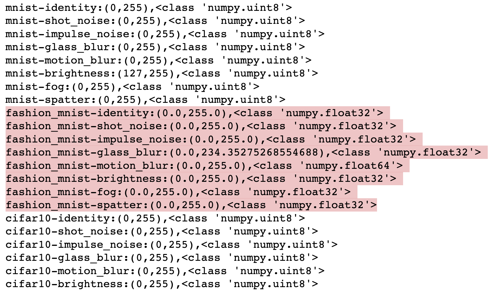
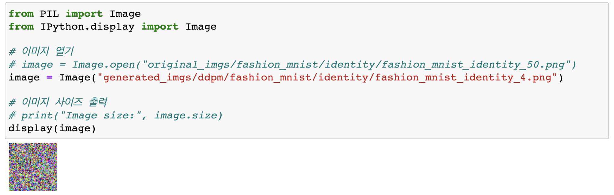

# DDPM-C

> 2023년 1월부터 지금까지 연구 진행 중이며,
>
> 연구일지 작성은 2023년 3월 27일부터 진행 중입니다.

### 2023.03.27

| Title                            | Success/Fail | Detail&Feedback                                              |
| -------------------------------- | :----------: | ------------------------------------------------------------ |
| GPU Set_UP with installing cudnn |      🔄       | - GPU Set Up시에는 tensorflow-gpu, CUDA, cudnn 세 개의 버전이 다 호환이 되어야 함. - cudnn의 버전 재설치 및 설정 필요 |

### 2023.03.28

| Title                                     | Success | Detail&Feedback                |
| ----------------------------------------- | :-----: | ------------------------------ |
| GPU Set UP with installing cudnn          |    ✅    | ipynb 파일 3개 이상 실행 못함. |
| Training dcgan with fashion mnist dataset |    ✅    |                                |
| Training wgan with fashion mnist dataset  |    ✅    |                                |
| Training ddpm with fashion mnist dataset  |    ✅    |                                |
| Generating images from ddpm               |    🔄    |                                |

### 2023.03.29

| Title                                                        | Success/Fail | Detail&Feedback                                              |
| ------------------------------------------------------------ | :----------: | ------------------------------------------------------------ |
| Generating images from ddpm                                  |      🔄       | - 아침에 생성 알고리즘에서 오류 발견 - 생성 중단하고 오류 수정 뒤 다시 진행. |
| Translating papers (part 1,2,3)                              |      ❌       |                                                              |
| Summarizing papers related to the vulnerability of Deep learning |      ❌       |                                                              |

### 2023.03.30

| Title                             | Success/Fail | Detail&Feedback                                              |
| --------------------------------- | :----------: | ------------------------------------------------------------ |
| Generating images from ddpm       |      🔄       | - 내일 오후정도면 이미지 추출 완료예정. - 현재 4개 중 2개의 데이터셋 추출 완료. |
| Translating papers (part 1,2,3)   |      🔄       |                                                              |
| Illustrating figures with draw.io |      🔄       |                                                              |

### 2023.03.31

| Title                                                | Success/Fail | Detail&Feedback                                              |
| ---------------------------------------------------- | :----------: | ------------------------------------------------------------ |
| Generating images of FashionM motion blur from dcgan |      ✅       |                                                              |
| Generating images of FashionM motion blur from wgan  |      ✅       |                                                              |
| Generating images of mnist identity from ddpm        |      ✅       | - 검토를 해보니 images of mnist identity from ddpm의 shape이 (3000,64,64,3)로 찍혔음. 다시 생성하였음. |
| Generating images of cifar100 motion blur from ddpm  |      ✅       |                                                              |
| Calculate FID scores                                 |      ❌       | - Kernel Dead 현상을 방지하기 위해 batch size를 적절하게 줄인다. |

 

### 2023.04.01

| Title                                                | Success/Fail | Detail&Feedback                                              |
| -------------------- | :-----: | ------------------------------------------------------------ |
| Calculate FID scores | 🔄    |                                                              |

### 2023.04.02

| Title                | Success/Fail | Detail&Feedback                                              |
| -------------------- | :----------: | ------------------------------------------------------------ |
| Calculate FID scores |      ✅       | - 원하는 결과가 안나왔음.  - 연구주제 변경 및 보완 필요함. |

### 2023.04.03

| Title            | Success | Detail&Feedback                                              |
| ---------------- | :-----: | ------------------------------------------------------------ |
| GPU Set_Up Again |    ✅    | - 현재 사용하고 있는 버전은 nvidia-smi 510.85.02 / cuda 11.6 / cudnn 8.8.0 /  tensorflow-gpu 2.11.0. 이렇게 하면 호환이 되지 않으며, cudnn버전을 8.2.0으로 변경하여 재설치하였음. |

**오류 원인**

- nvidia driver version, cuda version, cudnn version, tensorflow-gpu version 등 버전을 맞추기 위해서 계속 설치하고 했는데도 잘 안됨.
- `import tensorflow as tf` 를 입력하고 나오는 에러를 자세히 읽어보니 `from tensorflow.keras.scipy` (자세히 기억 안남)에서 오류가 잡힌 것을 발견.
- `pip install scipy`해서 최신 버전으로 재설치 하니 돌아갔다.
- 오류 원인은 아마도 `pip install fid-score`를 할 때 requirement내 scipy버전이 최신버전이 아니여서 발생한 것 같다. 
- **<u>오늘의 교훈 : 오류가 발생했을 때는 컴퓨터가 나에게 하는 말을 찬찬히 자세히 읽어보자!</u>**

### 2023.04.04

| Title                               | Success/Fail | Detail&Feedback                                              |
| ----------------------------------- | :----------: | ------------------------------------------------------------ |
| Calculating FId score again.        |      ✅       | - fashionM에서 예상치 못한 결과가 발생함.$^{1}$              |
| 데이터셋 확인 및 정리하기           |      ✅       | 1. np.uint8로 변환 2. 크기 (5000,64,64,3)으로 통일      |
| fashionM identity 학습 및 생성 진행 |      🔄       | - fashionM identity 생성 이미지가 잘못 생성되었음. 학습부터 생성까지 다시 진행하고 있다. |

**$^{1}$ 결과 원인** 

1) 데이터 타입이 다른 데이터셋은 np.uint8인 반면, fashionM은 np.float32였음.  $\rightarrow$ <u>np.uint8로 예쁘게 만들어준다.</u>
     
2) 한 데이터셋은 (5000,28,28,3)이었고, 다른 한 데이터셋은 (5000,64,64,3)이었다. $\rightarrow$ <u>모든 데이터셋 (5000,64,64,3)으로 통일시켰음.</u>
3) 생성된 이미지 중 하나를 출력했는데 아래와 같이 순수 노이즈 이미지가 나왔다. $\rightarrow$ <u>다시 학습시켜 생성 중.</u>
   

**<u>오늘의 교훈 : 데이터 전처리는 통일된 형태, 규칙적인 형태로 진행하는 것이 좋다. 아니면 오늘과 같은 현상 반복될 듯.</u>** 

### 2023.04.05

| Title                     | Success/Fail | Detail&Feedback |
| ------------------------- | :----------: | --------------- |
| Calculate FID score Again |      🔄       |                 |

